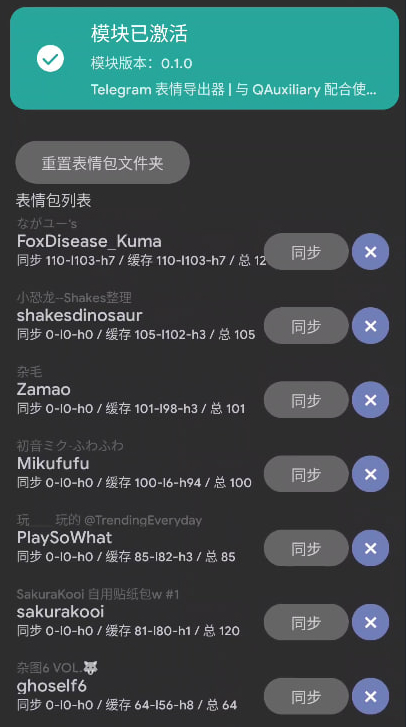

## Telegram Stickers Provider
A Xposed/LSPosed plugin to dump stickers from Telegram to QQ. Almost all 3rd-party telegram clients are supported.

### Release
You can download the latest release [here](https://t.me/microblock_pub/159).

### Compatibility

✅ NullGram  
✅ MDGram  
✅ Telegram (Official)  
✅ Telegram (Play)  
✅ AyuGram 

❎ Telegram X (and all its forks)

### Limitations
Only one Telegram client can be used to dump stickers at once. If the plugin is attached to multiple clients, only one of them could work, due to the limitation of Android. 

### Credits

This project used [YukiHookAPI](https://github.com/HighCapable/YukiHookAPI) and is greatly depended on the source code of [Telegram Android](https://github.com/DrKLO/Telegram). Thanks!
